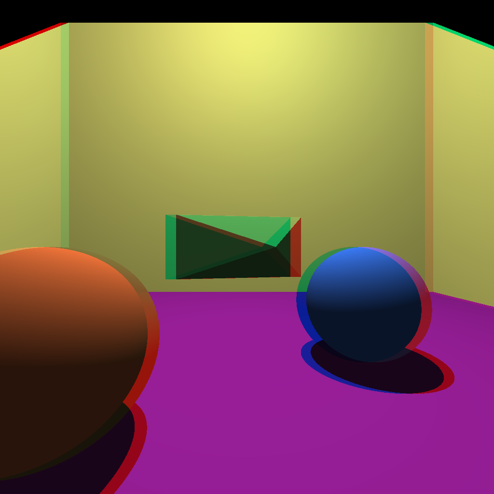
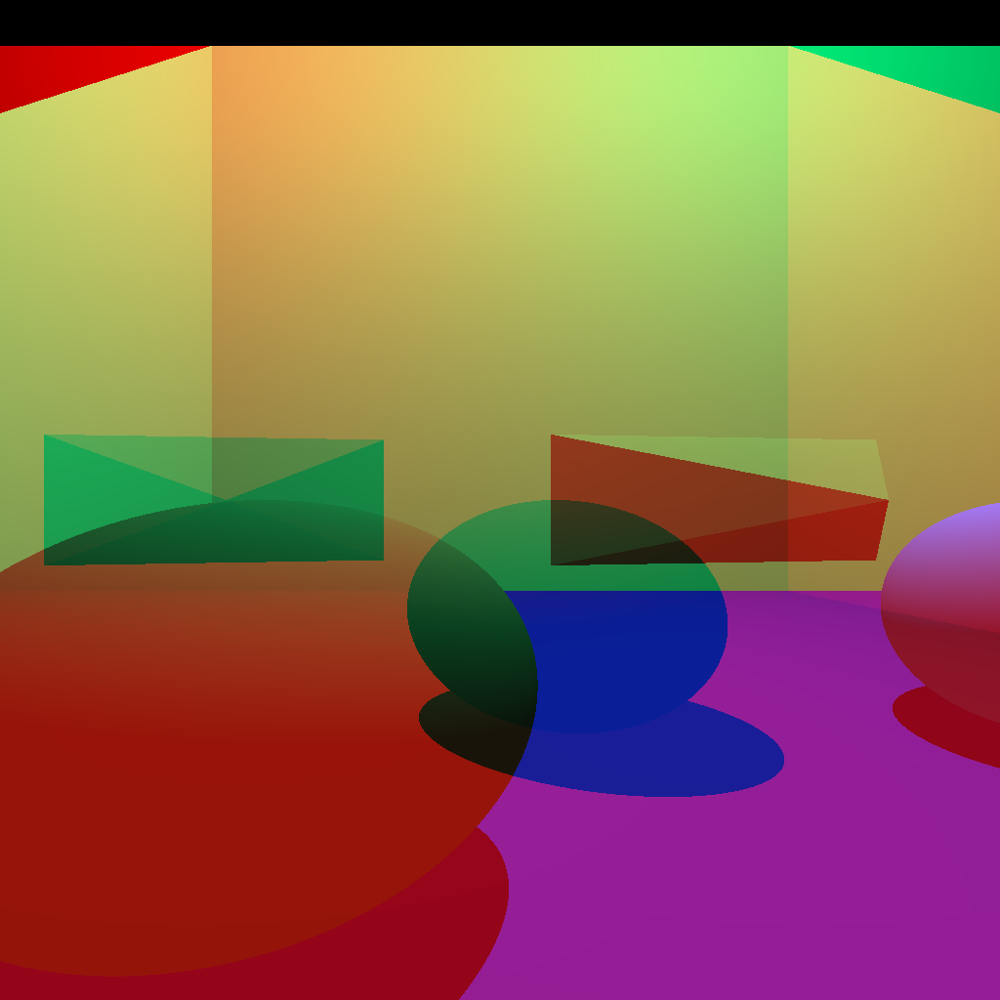
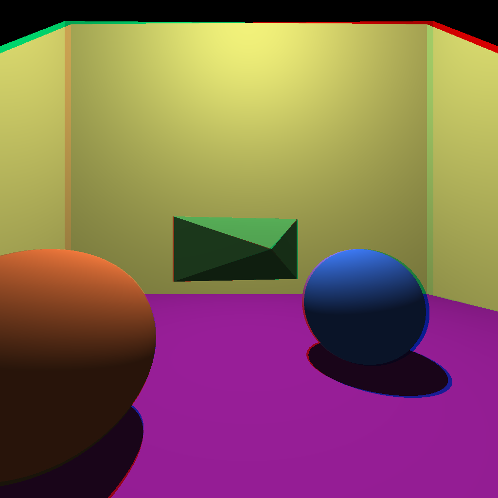
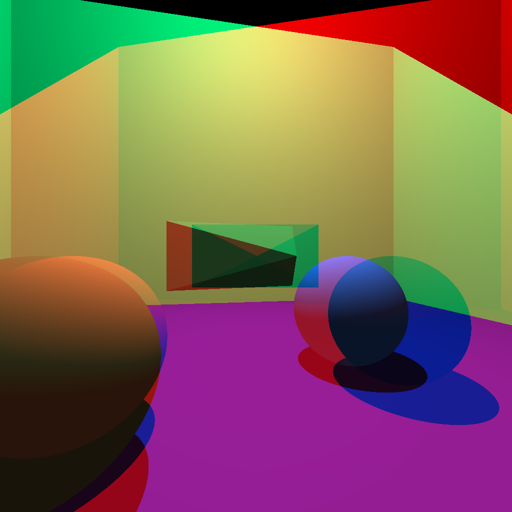

% Anaglypth Images using a Raytracer
% Tim Bradt
% 2/4/15

My methods for creating my images involved modifying a raytracer from a previous course
to generate a left and right eye image. Then I merged the images based on the pixel width 
to create the following anaglypth images. To create the color images, I took the red channel
of the left eye and the blue and green channels of the right and combined them togather to
create the red cyan mix for the image. Greyscale images are created by using the following
combination of grey: Left Grey, Right Grey, Right Grey.

To calculate the amount of pixels need to be shifted over to overlap the images for parallel
cameras, it required taking the camera offset and dividing by the pixel width. The pixel width
is found by taking the view plane width and dividing by the x resolution of the right and left eyes.
The new resolution of the final image is then calculated by taking the x resolution of the eyes
and subtracting the shifted pixel count.

~~~~ {#FinalResolution .c}
float pixelWidth = getPixelWidth(p.width, p.res_x);
#define ABS(x) ( x < 0 ? -x : x )
int shiftPixels = (!toe ? ABS(((shift[0] / pixelWidth) - 1)) : 0); 
int newXres = xres - shiftPixels;
~~~~~~~~~~~~~~~~~~~~~~~~~~~~~~~~~~~~~~~~~~~~~~~~~~~~~~~~~~~~~~~~~~~

When toeing the resolution does not change as the images are overlapped.
To put the images togather there must be an offset into the left image
based of the shifted pixel count.

~~~~ {#CreateImage .c}
for (unsigned int y = 0; y < yres; y++) {
    for (unsigned int x = 0; x < newXres; x++){
        unsigned int leftX = x + shiftPixels;
        unsigned int rightX = x;
        // Get Channels
        image[imageR] = newR;
        image[imageG] = newG;
        image[imageB] = newB;
    }
}
~~~~~~~~~~~~~~~~~~~~~~~~~~~~~~~~~~~~~~~~~~~~~~~~~~~~~~~~~~~~~~~~~~~

##Notes on images

I found from my raytracer that when having overly large inner eye distance
the effect falls apart and the images look terrible. However the small inner eye
distance create a believe able image in both the toed and parallel cameras.
Also because I had complete control over the scene, I did not have verical surround
issues. However, you can see the keystone issue with the small eye distance and see
exterated with the large eye distance. For better large eye distances, the camera should
be shifted back and the scene made more landscape-like.

##Other Images

File found at <http://commons.wikimedia.org/wiki/File%3ALGColorAnaglyphSceneMR.jpg> .

This scene was taken with 2 cameras 40cm apart for depth effect. This image uses a larger eye distance
in a way that is better then mine. As one can see, the image looks very well. This was most likely done
using a photo editing software to get the most pleasing effect, instead of programmicly like mine.

